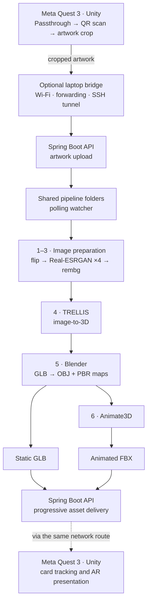
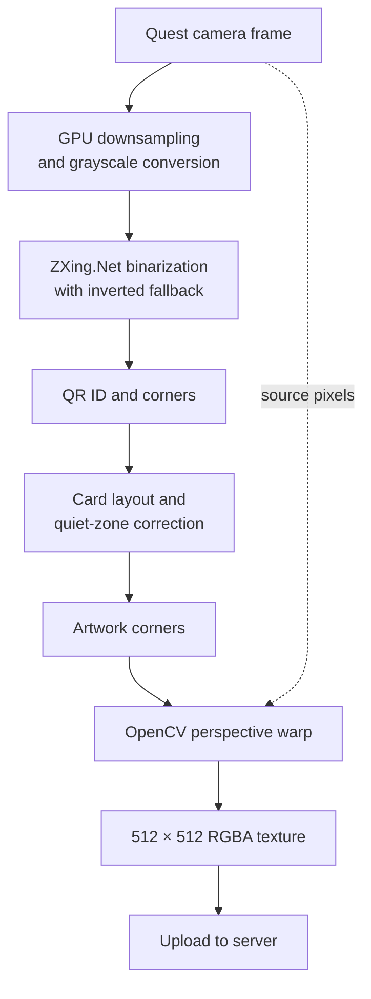
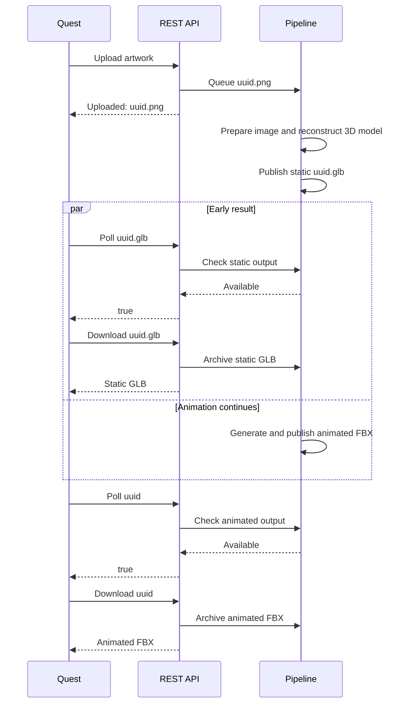

# ARtRise 🃏

> From printed card artwork to an animated 3D character in mixed reality.

ARtRise is a research prototype for physical-digital trading card games. A
Unity client running on a Meta Quest 3 recognizes QR-coded playing cards in
passthrough mode, extracts the artwork printed on each card, and sends that
artwork to a server-side generation pipeline. The system is designed to turn
the single image into a textured 3D asset and deliver the result progressively:
a static model becomes available first, while the more expensive animation
stage continues in the background. In the intended flow, the animated asset
replaces the static model on the physical card when it is ready.

The project keeps the cards tangible: players still hold, place, and move real
cards, while each card acts as the identity and spatial anchor for its virtual
character. The broader research system also adds game-state UI, status effects,
audio feedback, and voice-controlled actions.


## Table of contents

- [The idea](#the-idea)
- [System architecture](#system-architecture-)
- [Client: card recognition and AR presentation](#client-card-recognition-and-ar-presentation)
- [Server: generation and animation pipeline](#server-generation-and-animation-pipeline)
- [Progressive asset delivery](#progressive-asset-delivery)
- [REST API](#rest-api)
- [Repository structure](#repository-structure)
- [Requirements](#requirements)
- [Setup and execution](#setup-and-execution-)
- [Performance](#performance)
- [Research context](#research-context)
- [License and third-party components](#license-and-third-party-components)
- [Citation](#citation)

## The idea

Traditional trading cards are social and tangible, but their illustrations are
static. Fully digital adaptations can animate those characters, although they
can also reduce or remove physical and face-to-face interaction. ARtRise
explores a middle ground: retain the real cards and augment them in place.

In Live Mode, the complete interaction is intended to work as follows:

1. The Quest camera observes one or more physical cards in passthrough.
2. The client detects each QR code and identifies the corresponding card.
3. Because the card layout is known, the client derives the artwork corners
   from the QR-code corners and rectifies the perspective into a normalized
   artwork image.
4. The artwork—not the complete camera frame and not the QR code—is uploaded to
   the server through HTTP.
5. The server corrects the image orientation, upscales it, removes its
   background, and reconstructs a textured 3D model.
6. The static GLB is exposed as soon as it has been prepared, allowing the
   client to place an initial model on the card.
7. In parallel, the server converts the mesh into the representation expected
   by Animate3D and generates a motion sequence.
8. In the documented research flow, the server converts the animated FBX back
   to GLB and the client replaces the static model with that animated GLB. The
   current checkout stops at FBX instead, so this final hand-off requires either
   client-side FBX support or restoration of the server-side conversion.

This two-step delivery is central to ARtRise: model generation is relatively
fast compared with animation generation, so the player receives visual feedback
without waiting for the complete pipeline.

## System architecture 🔄

The logical system has three layers: the Quest client, an optional network
bridge used by the research deployment, and the remote generation server.



The laptop bridge is a deployment choice rather than a logical requirement.
In the evaluated setup, the Quest joined a laptop-hosted wireless network and
the laptop forwarded requests through an SSH tunnel to remote compute
infrastructure. A directly reachable server could expose the same REST API
without this intermediate hop.

## Client: card recognition and AR presentation

The research client is a Unity application for the Meta Quest 3. It uses
passthrough so that physical cards and nearby players remain visible, while
generated models and UI are rendered into the same space.

### QR detection and artwork extraction

Every card combines an illustration with a QR code. The code contains a
randomly generated link whose final path segment identifies the card. The
client requests the left passthrough-camera stream at 1280 × 960, downsamples
and converts frames to grayscale on the GPU, and reads the result back
asynchronously. ZXing.Net then tries hybrid, global-histogram, and inverted
hybrid binarization. The checked-in scenes select multi-code detection, allowing
several cards to be recognized in one frame, and request a new scan roughly
every 30 rendered frames.

The QR code is not only an identifier. Its detected corners provide a geometric
reference for the fixed card layout. The active extractor estimates a
four-module quiet zone around a 27-module QR area, derives the adjacent artwork
quadrilateral, and applies an OpenCV homography to remove camera perspective.
The result is a 512 × 512 RGBA texture. An alternative contour- and
color-marker-based card extractor is also included, but its call is disabled in
the current scanner path.



In the experimental path, the client collects six normalized artwork captures
for a newly seen QR code and uploads all six as separate PNG files named from
the card ID. The QR code is then marked as uploaded so later detections update
tracking and game state without collecting another batch. Because the server
assigns a new UUID to every uploaded file, this currently creates six
independent generation jobs rather than one multi-view job.

### AR and game feedback

The client uses Meta XR for passthrough, hand/controller interaction, gaze-based
selection, and environment raycasts. Camera intrinsics and raycasts through the
QR center or individual corners turn image-space detections into a world-space
card pose. Position, rotation, and scale are smoothed before the imported model
is rendered above its corresponding physical card.

GLB assets are loaded at runtime with glTFast. In the study scenes, a preloader
copies bundled models from `StreamingAssets/gameobjects` into the application's
persistent storage before they are instantiated. The experimental downloader
can retry static GLB downloads, but it does not currently request the server's
animated asset or replace an already loaded static model.

The complete research experience also supports:

- remaining card health, active effects and counters, the element a card can
  cast, and the opposing card types against which it is effective;
- a player HUD with turn indication and player/enemy health;
- model tinting for status effects—blue for frost, red for fire, and yellow for
  stun;
- audio cues for a new-card scan, an attack, an invalid move, card death, and
  player defeat;
- spoken card selection through wit.ai and Meta's `AppVoiceExperience`.

The checked-in project records Unity `6000.0.39f1`, glTFast `6.14.1`,
ZXing.Net `0.16.10`, OpenCV for Unity `3.0.1`, and Meta XR SDK/MRUK `81.0.0`.
The manifest also contains older direct Meta Core/Interaction entries at
`72.0.0`, although the package lock resolves those packages to `81.0.0`. The
higher versions reported in the thesis describe a later evaluation environment
and should not be treated as this checkout's dependency locks.

### Live Mode and Study Mode

- **Live Mode** captures artwork and requests newly generated assets during the
  session. The code calls this `experimentalMode`; it is serialized as disabled
  in the checked-in scenes and its current server hand-off is incomplete.
- **Study Mode** uses animated assets that were generated in advance and stored
  locally on the headset. Scenes `A`, `B`, and `C` encode the study conditions
  with models and UI, models only, and UI only, respectively. This mode was
  created to keep the user study uninterrupted by the long animation stage.

## Server: generation and animation pipeline

The server is the checked-in core of this repository. It combines a small
Spring Boot interface with Python, shell, Blender, and several external machine
learning projects. ARtRise does not fine-tune or replace those models; its main
technical contribution is composing them into a single progressive pipeline.

### Processing stages

| Stage | Implementation | Input → output | Relevant behavior |
|---|---|---|---|
| Upload | Spring Boot | multipart image → `UUID.<ext>` | Accepts PNG, JPG/JPEG, BMP, and WEBP. The completed upload is atomically moved into the pipeline so workers never read a partial file. |
| 1. Vertical correction | Pillow | original image → flipped image | Flips top-to-bottom to correct the row orientation of the Quest camera texture buffer, then removes the source file. |
| 2. Super-resolution | Real-ESRGAN | flipped image → 4× image | The checked-in wrapper defaults to `RealESRGAN_x4plus`, scale `4`, tile size `0`, and half precision unless `--fp32` is supplied. |
| 3. Background removal | rembg | upscaled image → transparent PNG | Intended to isolate the foreground character using the rembg CLI and its U²-Net-based default model. |
| 4. 3D reconstruction | TRELLIS | foreground PNG → textured GLB | Loads a local `TRELLIS-image-large`, uses seed `1`, removes approximately 95% of triangles during simplification, and uses a 1024-pixel texture. The model remains resident in a long-running worker. |
| 5. Animation preparation | headless Blender | GLB → triangulated OBJ + PBR maps | Extracts or creates diffuse, metallic, roughness, normal, and PBR textures. It also copies the GLB into `static_models`, making the early result downloadable. |
| 6. Mesh animation | Animate3D | OBJ package → animated FBX | Converts the mesh to Gaussians, renders four views, generates a 16-frame motion, segments the frames, optimizes a trajectory, and transfers it back to the mesh. The included script creates a generic idle animation. |

The research configuration used `RealESRGAN_x4plus_anime_6B` in FP16 because
the cards contained anime-style artwork. The current wrapper instead defaults
to `RealESRGAN_x4plus`; reproducing a paper result therefore requires selecting
the intended model explicitly and recording that configuration.

The thesis references Spring Boot 4.0.6, rembg 2.0.76, and Blender 5.1. The
current checkout instead uses Spring Boot 4.0.0, pins rembg 2.0.77, and does not
include a Blender binary. These paper versions are historical configuration
evidence, not dependency locks for this repository.

### Filesystem orchestration

There is no database or message broker. Directories are the pipeline's implicit
state machine, and a polling watcher is intended to start the next worker when
a new artifact appears.

```text
server/pipeline/
├── input/
│   └── original_image/                     # HTTP uploads
├── stages/
│   ├── image_preparation/
│   │   ├── flipped_image/                  # orientation corrected
│   │   ├── upscaled_image/                 # Real-ESRGAN output
│   │   └── background_removed/             # transparent character PNG
│   └── model_generation/
│       └── generated_glb/                  # TRELLIS hand-off
└── output/
    ├── static_models/<uuid>.glb             # early client result
    ├── animated_models/<uuid>/
    │   └── animate3d_model.fbx              # final current-checkout result
    └── archive/
        ├── static_models/                   # downloaded GLBs
        └── animated_models/                 # downloaded FBXs
```

For animation, Blender additionally creates this package inside the Animate3D
component:

```text
components/Animate3D/data/animate3d/mesh/obj_file/<uuid>/
├── base.obj
├── base.mtl
├── texture_diffuse.png
├── texture_metallic.png
├── texture_normal.png
├── texture_pbr.png
└── texture_roughness.png
```

The image-stage workers remove inputs after successful processing. Blender is
an exception: it archives and removes every discovered GLB even if OBJ
conversion failed. When the service handles a valid download request, it reads
the asset into memory and moves the file into `archive/` before the controller
returns the response bytes. The live download is therefore effectively
one-shot even if the later HTTP transfer fails.

## Progressive asset delivery

The server exposes two progressive outputs. Every upload receives
a new server-generated UUID. `ModelPipelineCustom` logs the plain-text upload
response without retaining that UUID, while the download code expects numbered
card files such as `1.glb` and `-1.glb`.

A compatible client must parse the UUID asset stem from each upload response
and poll two names: `<uuid>.glb` for the early static model, then bare `<uuid>`
for the animation. The API does not push completion events or return a durable
job record. The following sequence therefore documents the current **server
contract and intended client behavior**, not a working end-to-end flow in this
revision:



The thesis places an additional FBX-to-GLB conversion on the server, moves the
animated GLB into the server download directory, and then lets the client
retrieve it.

## REST API

The web interface binds to `0.0.0.0:8080` by default and exposes three
unauthenticated endpoints under `/files`.

| Method | Endpoint | Purpose | Response |
|---|---|---|---|
| `POST` | `/files/upload` | Upload extracted artwork as multipart field `file` | Plain text: `Uploaded: <uuid>.<ext>` |
| `GET` | `/files/exists/{name}` | Poll `<uuid>.glb` for the static asset or bare `<uuid>` for animation | Boolean `true` or `false` |
| `GET` | `/files/download/{name}` | Download `<uuid>.glb`, or bare `<uuid>` which resolves to `<uuid>/animate3d_model.fbx` | GLB as `model/gltf-binary`; animation as `application/octet-stream` |

Multipart files and multipart requests are each capped at 200 MB.
`exists=false` means only that the asset is not in the public output directory;
it does not distinguish queued, processing, failed, already downloaded, or
unknown jobs.

### Example request flow

```bash
# 1. Upload normalized artwork. Keep the UUID returned in the plain-text body.
curl --fail -F "file=@artwork.png" http://SERVER:8080/files/upload
# Uploaded: 7b3b29a0-0000-0000-0000-123456789abc.png

ASSET_ID="7b3b29a0-0000-0000-0000-123456789abc"

# 2. Poll and download the early static asset.
curl --fail "http://SERVER:8080/files/exists/${ASSET_ID}.glb"
curl --fail -o "${ASSET_ID}.glb" \
  "http://SERVER:8080/files/download/${ASSET_ID}.glb"

# 3. Poll and download the final animated asset.
curl --fail "http://SERVER:8080/files/exists/${ASSET_ID}"
curl --fail -o animate3d_model.fbx \
  "http://SERVER:8080/files/download/${ASSET_ID}"
```

The API currently reads each download fully into memory before responding. It
has no authentication, TLS termination, rate limiting, job ownership, progress
reporting, or persistent status store and should only be exposed on a trusted
development or laboratory network.

## Repository structure

```text
ARtRise/
├── client/
│   ├── Assets/
│   │   ├── Samples/3 QRCodeTracking/   # Quest QR pipeline and study scenes
│   │   ├── StreamingAssets/            # pre-generated Study Mode GLBs
│   │   ├── OpenCVForUnity/              # imported computer-vision asset
│   │   └── *.cs                         # gameplay, UI, voice, and GLB loading
│   ├── Packages/                        # Unity package manifest and lock file
│   ├── ProjectSettings/                 # Android, XR, build-scene configuration
│   └── README.md
├── server/
│   ├── components/                      # external Git submodules
│   │   ├── Animate3D/
│   │   ├── Real-ESRGAN/
│   │   ├── TRELLIS/
│   │   └── rembg/
│   ├── scripts/
│   │   ├── run.py                       # intended process supervisor
│   │   ├── watcher/watcher.py           # polling orchestration
│   │   └── workers/                     # project-specific adapters
│   ├── shell/                           # Blender/Real-ESRGAN launch wrappers
│   ├── webserver/                       # Java 17 / Spring Boot REST service
│   └── README.md                        # detailed server setup notes
├── .gitmodules
├── LICENSE                              # MIT license for ARtRise source
└── README.md
```

Code below `server/scripts`, `server/shell`, and `server/webserver` is the
ARtRise integration layer. The projects under `server/components` are pinned
external repositories with their own documentation, dependencies, and license
terms. The Unity project root is `client/`; generated Unity directories such as
`Library`, `Temp`, `Logs`, and build outputs are intentionally not required for
a portable source checkout.

## Requirements

### Client

Running the client requires a Meta Quest 3 and, for Live Mode, network access
to the REST API. To rebuild and deploy it, use:

- Unity `6000.0.39f1` with Android Build Support, including the Android SDK,
  NDK, and OpenJDK modules;
- a developer-enabled Quest 3 and a machine authorized for Android deployment;
- the package versions recorded in `client/Packages/manifest.json` and
  `packages-lock.json`, including Meta XR, OpenXR, URP, and glTFast;
- ZXing.Net `0.16.10` and a properly licensed OpenCV for Unity `3.0.1`
  installation with its Android native libraries;
- a reachable server endpoint and, if voice commands are enabled, a private
  wit.ai configuration supplied by the developer.

The checked-in Player Settings target Android API level 32, ARM64 with IL2CPP,
and the package identifier `com.ulmuniversity.artrise`. The Android manifest
declares headset-camera, hand-tracking, scene, anchor, and boundary permissions,
as well as the passthrough feature. The project contains the required settings and a Quest build.


### Server

The complete pipeline is Linux- and CUDA-oriented and has significantly higher
requirements than the REST interface alone:

- a modern Linux system with Bash;
- Conda or a compatible environment manager;
- an NVIDIA GPU with enough memory for TRELLIS and Animate3D—upstream guidance
  is at least 16 GB for TRELLIS and approximately 24 GB for Animate3D;
- compatible NVIDIA drivers, CUDA runtimes, compilers, and PyTorch builds;
- Java 17 for Spring Boot; the included wrapper downloads Maven 3.9.11 on first
  use and therefore needs network access or an already populated wrapper cache;
- Blender available as `server/components/Blender/blender` or through
  `BLENDER_EXECUTABLE`;
- disk space for multiple large model checkpoints, compiled CUDA extensions,
  temporary renders, meshes, and generated assets.

Do not install the complete ML stack into one Python environment. TRELLIS and
Animate3D target incompatible PyTorch/CUDA generations, while the pinned rembg
requires Python 3.11 or newer below Python 4.0 (its classifiers currently list
3.11–3.13). The integration expects these default environments:

| Environment | Purpose |
|---|---|
| `art-rise-base` | lightweight image-flip worker |
| `art-rise-realesrgan` | Real-ESRGAN inference |
| `art-rise-rembg` | rembg and its selected ONNX Runtime backend |
| `art-rise-trellis` | TRELLIS and native CUDA extensions |
| `art-rise-animate3d` | Animate3D, threestudio, and native extensions |

The full dependency and compatibility discussion is in
[`server/README.md`](server/README.md). Always compare it with each pinned
component's own installation guide.

### Required external assets

Large binaries and model weights are not committed. At minimum, the current
paths expect:

- a local TRELLIS checkpoint at `server/components/TRELLIS-image-large/`;
- `server/components/Animate3D/pretrained_models/animate3d_motion_modules.ckpt`;
- the additional Animate3D extensions and Tracking Anything/SAM dependencies;
- additional Hugging Face models used by Animate3D and the SAM, XMem, and E2FGVI
  checkpoints used by Tracking Anything, which may download on first use;
- a Blender executable, which is not included as a submodule;
- Real-ESRGAN weights, downloaded by its upstream inference script when needed;
- a rembg/U²-Net ONNX model, normally cached under `~/.u2net` or a persistent
  `U2NET_HOME`.

Model checkpoints can have license or access terms independent of their source
repositories. Review them before redistribution.

## Setup and execution 🚀

### 1. Clone all pinned components

```bash
git clone --recurse-submodules https://github.com/Tolga-Tolga/ARtRise.git
cd ARtRise
git submodule update --init --recursive
git submodule status
```

Use the pinned commits as a reproducible baseline. Updating individual
submodules to their latest upstream revisions can change APIs, dependencies,
model behavior, and CUDA compatibility.

### 2. Open and configure the Unity client

Open `client/` as a project in Unity Hub with Unity `6000.0.39f1` and let the
Package Manager restore the locked dependencies. Verify that ZXing.Net and the
licensed OpenCV for Unity Android plugin are available before compiling. The
build list contains the mode-selection/UI scene, the QR tracking scene, the
three study conditions (`A`, `B`, and `C`), and the `Experimental` scene.

Before attempting Live Mode:

1. replace the development address currently embedded in
   `ModelPipelineCustom.cs` and serialized in the experimental downloader with
   an address reachable from the headset;
2. account for the server's default port `8080` or deliberately forward the
   research-client port `18082`;
3. implement the UUID-to-card association and animated-result hand-off
   described under [Progressive asset delivery](#progressive-asset-delivery);
4. enable `experimentalMode` in the intended scene; and
5. provide a valid wit.ai configuration locally if voice commands are needed.

Never commit voice-service tokens or other credentials. Once the client
integration steps above are completed, build for Android/ARM64, deploy to the
Quest, and grant the requested headset camera and passthrough permissions.

### 3. Prepare component-specific environments

Install TRELLIS, Real-ESRGAN, rembg, and Animate3D independently, following the
pinned upstream instructions and the notes in
[`server/README.md`](server/README.md). Then place the required model weights
and Blender executable at the paths described above.

Install rembg with its CLI extra—for example, `pip install ".[cpu,cli]"` from
the pinned component directory, or the equivalent GPU extra. The CLI command
used by the adapter is not installed by the backend-only extra documented in
the current server notes.

Also note that TRELLIS's upstream `setup.sh --new-env` creates an environment
named `trellis`, while the ARtRise supervisor expects `art-rise-trellis`. Create
the expected environment or set `ARTRISE_TRELLIS_ENV=trellis` deliberately.

### 4. Start the REST interface

Run the Maven wrapper through Bash because it is not executable in the current
Git index:

```bash
cd server/webserver
bash ./mvnw spring-boot:run
```

Starting it from `server/webserver` is important because its default storage
paths are relative to that directory.

### 5. Start the generation pipeline

The intended supervisor entry point is:

```bash
# From the repository root, after addressing the current integration issues.
python server/scripts/run.py
```

It is designed to start the polling watcher and a persistent TRELLIS worker;
the Spring Boot process remains separate. In the current checkout, the
supervisor and several automatic hand-offs still require integration fixes, so
this command should be understood as the designed entry point rather than a
verified one-command launch.

### Configuration

| Variable | Default / purpose |
|---|---|
| `CONDA_EXE` | `conda`; executable used by the supervisor and watcher |
| `ARTRISE_FLIP_ENV` | `art-rise-base` |
| `ARTRISE_REALESRGAN_ENV` | `art-rise-realesrgan` |
| `ARTRISE_REMBG_ENV` | `art-rise-rembg` |
| `ARTRISE_TRELLIS_ENV` | `art-rise-trellis` |
| `ARTRISE_ANIMATE3D_ENV` | `art-rise-animate3d` |
| `ANIMATE3D_SCRIPT` | animation worker, defaults to `server/scripts/workers/Animate_3D/idle.sh` from the repository root |
| `BLENDER_EXECUTABLE` | Blender binary, defaults to `server/components/Blender/blender` |
| `PIPELINE_INPUT_DIR` | API upload directory |
| `PIPELINE_OUTPUT_DIR` | animated-model public directory |
| `PIPELINE_GLB_DIR` | static-model public directory |
| `PIPELINE_ARCHIVE_DIR` | downloaded-asset archive |
| `U2NET_HOME` | optional persistent rembg model cache |

The four `PIPELINE_*` variables configure Spring Boot only. The Python workers
use fixed locations under `server/pipeline`; changing the API variables does
not relocate worker storage. Any overrides must therefore resolve to those same
directories—or the worker code must also be changed—and both sides must access
the same underlying filesystem.

## Performance

The research deployment reported the following stage measurements for one
approximately 500 KB, 709 × 1200 input image:

| Pipeline stage | Reported time |
|---|---:|
| Image flipping | 1.4 s |
| Super-resolution | 37.9 s |
| Background removal | 10.0 (unit omitted in the source table; approximately seconds) |
| Static model generation | 30.0 s |
| Animation generation | 11 min 41.2 s |

These are reference measurements, not service-level guarantees or a single
end-to-end total. They were collected on a research compute node with four
NVIDIA A100 40 GB GPUs, two Intel Xeon Gold 6248R CPUs, and 377 GiB RAM. CUDA
11.8 was used for Real-ESRGAN and Animate3D, while TRELLIS used CUDA 12.9.

The paper elsewhere describes the static result as taking approximately 20
seconds, while its measurement table and limitations section use approximately
30 seconds. Runtime also changes with input size, selected models, GPU,
attention backend, native extensions, warm-up state, and worker scheduling.
The robust conclusion is therefore relative: animation is much slower than
static reconstruction, which motivates progressive delivery.

## Research context

ARtRise was developed for the 2026 Media Informatics bachelor's thesis
*Effects of Immersive AI-Generated Avatars on Game Engagement and Intrinsic
Motivation in Physical-Digital AR Card Games* at Ulm University.

The within-subjects study included 16 participants and compared three ten-minute
conditions:

1. **Avatars & UI** — animated models plus game-state interface;
2. **Only Avatars** — animated models without the interface;
3. **Only UI** — interface without animated models.

The combined condition showed the strongest overall pattern. It outperformed
the avatar-only condition in perceived competence, perceived choice, usability,
and pragmatic quality; it was also rated more immersive than UI alone. The
results suggest that avatars contribute experiential richness while UI provides
the state clarity needed to make those avatars useful during play.

The following table is an accessible numerical summary of the statistically
confirmed contrasts shown in the thesis's questionnaire boxplots. Values are
mean (standard deviation); the thesis labels the same conditions `UI + Models`,
`Models`, and `UI`, respectively. Scales have different ranges and should not
be compared with one another.

| Measure | Avatars & UI | Only Avatars | Only UI | Holm-corrected contrast |
|---|---:|---:|---:|---|
| UPEQ competence | 4.17 (0.68) | 3.41 (0.88) | 4.06 (0.52) | Avatars & UI and Only UI > Only Avatars (`p_adj = .016` each) |
| IMI perceived competence | 6.06 (0.71) | 5.49 (0.84) | 5.74 (0.81) | Avatars & UI > Only Avatars (`p_adj = .022`) |
| IMI perceived choice | 6.04 (0.66) | 5.62 (0.69) | 5.70 (0.61) | Avatars & UI > Only Avatars (`p_adj = .019`) |
| TUI immersion | 14.69 (5.64) | 13.25 (6.86) | 11.31 (5.68) | Avatars & UI > Only UI (`p_adj = .003`) |
| SUS usability | 85.00 (10.41) | 69.53 (17.23) | 78.75 (7.96) | Avatars & UI > Only Avatars (`p_adj = .015`) |
| UEQ-S pragmatic quality | 1.47 (1.02) | 0.55 (0.98) | 0.69 (0.98) | Avatars & UI > Only Avatars (`p_adj = .006`) |

Overall preference followed the same pattern: the lower-is-better mean ranks
were 1.19 for Avatars & UI, 2.00 for Only UI, and 2.81 for Only Avatars.

These findings are exploratory. All 16 participants were male, two participants
had partially missing objective logs, and the evaluation used Study Mode with
pre-generated local assets. It therefore evaluated the experience of avatars
and UI, not the waiting time or reliability of a complete Live Mode session.


## License and third-party components

ARtRise's original source code is licensed under the
[MIT License](LICENSE). This license does not relicense bundled third-party
projects, imported assets, model checkpoints, or services; their own terms
continue to apply.

The following repositories are pinned as Git submodules:

| Component | Role in ARtRise | Component license |
|---|---|---|
| [TRELLIS](https://github.com/microsoft/TRELLIS) | single-image 3D reconstruction | MIT |
| [Real-ESRGAN](https://github.com/xinntao/Real-ESRGAN) | 4× artwork super-resolution | BSD 3-Clause |
| [Animate3D](https://github.com/yanqinJiang/Animate3D) | prompt-guided 3D mesh animation | Apache License 2.0 |
| [rembg](https://github.com/danielgatis/rembg) | foreground segmentation and alpha mask | MIT |

ARtRise also relies on Blender, Spring Boot, Unity, Meta XR, ZXing.Net, OpenCV
for Unity, wit.ai, and transitive ML dependencies. Their respective terms—and
the terms of model checkpoints—must be reviewed separately. In particular,
OpenCV for Unity is an imported Unity Asset Store product; its redistribution
terms are separate from the license of the underlying OpenCV library and must
be checked before publishing the imported asset tree.

The licenses inside submodules apply to those components only. Likewise, the
Creative Commons license of the associated thesis applies to the thesis, not to
third-party components included with or used by ARtRise.

## Citation

If you use ARtRise in academic work, cite the underlying thesis:

